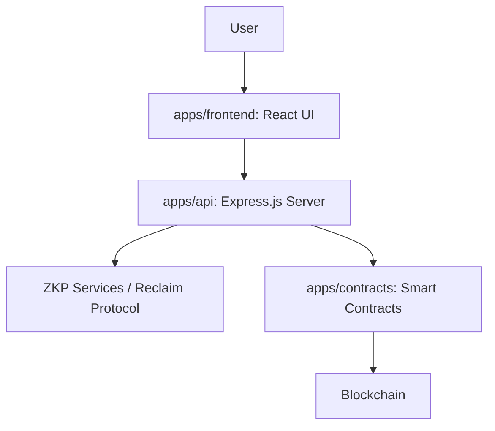

# ZKP Template Project

This project is a template for building applications leveraging zero-knowledge proofs. It's structured as a monorepo with distinct applications for handling smart contracts, frontend interface, and backend API logic.

## Project Structure

The project is organized into the following main applications located within the `apps/` directory:

-   **`apps/contracts`**: Manages the smart contracts for the application. This is a Hardhat project.
-   **`apps/frontend`**: The user interface of the application, built with React, Vite, and TypeScript.
-   **`apps/api`**: The backend server, built with Express.js. It likely handles business logic and integrates with ZKP systems like the Reclaim Protocol.

## Architecture

The following diagram illustrates the high-level architecture of the system:



### Components:

*   **User**: Interacts with the application through the frontend.
*   **`apps/frontend`**: Provides the graphical user interface. It communicates with the `apps/api` for data and backend operations.
*   **`apps/api`**: The central backend service. It handles requests from the frontend, interacts with ZKP services (e.g., Reclaim Protocol) to generate or verify proofs, and communicates with the smart contracts on the blockchain.
*   **ZKP Services / Reclaim Protocol**: External or internal services responsible for the zero-knowledge proof generation and verification.
*   **`apps/contracts`**: Contains the smart contracts deployed on a blockchain. These contracts might store state, enforce rules, or verify proofs.
*   **Blockchain**: The underlying distributed ledger where the smart contracts are deployed and executed.

## Getting Started

This section guides you through setting up and running the project locally.

### Prerequisites

*   **Node.js and pnpm**: Ensure you have Node.js (v18 or higher recommended) and pnpm (v10.4.1 or as specified in `packageManager` in `package.json`) installed.
*   **Wallet**: A compatible Ethereum wallet (like MetaMask) configured for the Base Sepolia test network.
*   **Base Sepolia ETH**: You'll need Base Sepolia ETH in your deployer account to deploy contracts and pay for gas fees. [Coinbase has a faucet](https://portal.cdp.coinbase.com/products/faucet) for getting funds
*   **Reclaim Protocol Credentials**: Sign up at [Reclaim Protocol Developer Portal](https://dev.reclaimprotocol.org/) to get an `APP_ID` and `API_SECRET`.
*   **Basescan API Key**: Obtain an API key from [Basescan](https://basescan.org/) if you want to verify your deployed contracts.
*   **RPC URL**: Obtain a Base Sepolia RPC URL from a provider like Alchemy or Infura

### Environment Setup

1.  **Create a `.env` file** in the root of the project by copying the example below.
2.  **Fill in the required values**.

Create a `.env` file in the project root with the following content:

```env
# Required for deploying and interacting with smart contracts on Base Sepolia
BASE_SEPOLIA_RPC_URL="YOUR_BASE_SEPOLIA_RPC_URL"
DEPLOYER_PRIVATE_KEY="YOUR_DEPLOYER_WALLET_PRIVATE_KEY"
ETHERSCAN_API_KEY="YOUR_BASESCAN_API_KEY" # For contract verification on Basescan

# Required for the Reclaim Protocol integration in the API
RECLAIM_APP_ID="YOUR_RECLAIM_APP_ID"
RECLAIM_API_SECRET="YOUR_RECLAIM_API_SECRET"

# API Server Port (optional, defaults to 8080 if not set)
# PORT=8080

# URL for the frontend to connect to the API server
VITE_API_URL="http://localhost:8080" # Adjust if your API runs on a different port

# These variables will be automatically added/updated by the contract deployment script:
# BASE_SEPOLIA_VERIFY_CONTRACT_ADDRESS=
# VITE_BASE_SEPOLIA_VERIFY_CONTRACT_ADDRESS=
```

**Important Security Note**: Never commit your `.env` file containing sensitive information like private keys or API secrets to version control. Ensure `.env` is listed in your `.gitignore` file.

### Installation

Install project dependencies using pnpm:

```bash
pnpm install -r
```
This command will install dependencies for the root project and all applications within the `apps/` directory.

### Running the Applications
1.  **Deploy Smart Contracts (to Base Sepolia):**

    Before the frontend can interact with the smart contract, you need to deploy it.
    Ensure your `.env` file has the `BASE_SEPOLIA_RPC_URL`, `DEPLOYER_PRIVATE_KEY`, and `ETHERSCAN_API_KEY` correctly set.

    ```bash
    pnpm run deploy:contracts
    ```
    This script will:
    *   Compile the smart contracts.
    *   Deploy them to the Base Sepolia network.
    *   Attempt to verify them on Basescan.
    *   Update your root `.env` file with `BASE_SEPOLIA_VERIFY_CONTRACT_ADDRESS` and `VITE_BASE_SEPOLIA_VERIFY_CONTRACT_ADDRESS`.

2.  **Start all applications in development mode:**

    ```bash
    pnpm run start:app:dev
    ```
    This will concurrently start:
    *   The Frontend (React/Vite) - typically on `http://localhost:5173` (check terminal output)
    *   The API (Express.js) - typically on `http://localhost:8080` (or the `PORT` you specified)


Each application within the `apps/` directory also contains its own `README.md` and `package.json` for more specific instructions and details. 